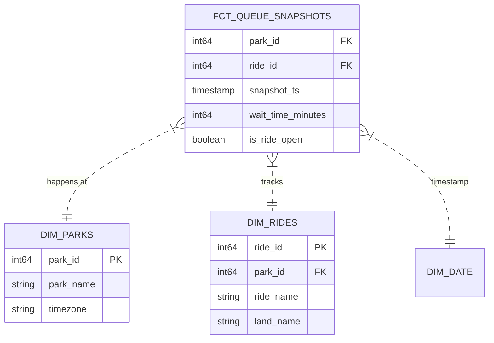

# 🎢 Amusement Park Data Model (Gold Layer)

**Status**: Active  
**Grain**: One row per ride, per timestamp (5-minute intervals).  
**Update Frequency**: Daily (Batch)

## 🗺️ Visual Schema

# 📊 Table Definitions

## 📋 FCT_QUEUE_SNAPSHOTS
The central fact table containing historical wait times.

Columns:
- `snapshot_ts`: 
    - Type: TIMESTAMP
    - The UTC time when the wait time was recorded. Partition Key.
    - Source Field: `timestamp`
- `park_id`:
    - Type: INT64
    - Foreign Key to `DIM_PARKS.park_id`.
    - Source Field: `park_id`
- `ride_id`:
    - Type: INT64
    - Foreign Key to `DIM_RIDES.ride_id`.
    - Source Field: `ride_id`
- `wait_time_minutes`:
    - Type: INT64
    - The posted wait time in minutes. Nulls converted to 0.
    - Source Field: `wait_time`
- `is_ride_open`:
    - Type: BOOLEAN
    - Status flag. derived from string "true"/"false"
    - Source Field: `is_open`

## 📋 DIM_PARKS
Contextual information about the amusement parks (Location, Metadata).

Columns:
- `park_id`:
    - Type: INT64
    - Primary Key
    - Source Field: `park_id`
- `park_name`:
    - Type: STRING
    - Official Name of the park
    - Source Field: `name`
- `timezone`:
    - Type: STRING
    - IANA Timezone ID (e.g., 'Europe/Paris'). Critical for local time conversions.
    - Source Field: `timezone`
- `country`:
    - Type: STRING
    - Country name where the park is located
    - Source Field: `country`

## 📋 DIM_RIDES
Hierarchy of rides within parks.

Columns:
- `ride_id`:
    - Type: INT64
    - Primary Key
    - Source Field: `ride_id`
- `park_id`:
    - Type: INT64
    - Foreign Key to `DIM_PARKS.park_id`. A ride belongs to exactly one park.
    - Source Field: `park_id`
- `ride_name`:
    - Type: STRING
    - Name of the attraction
    - Source Field: `name`
- `land_name`:
    - Type: STRING
    - Themed area (e.g., "Fantasyland", "Discoveryland")
    - Source Field: `land_name`